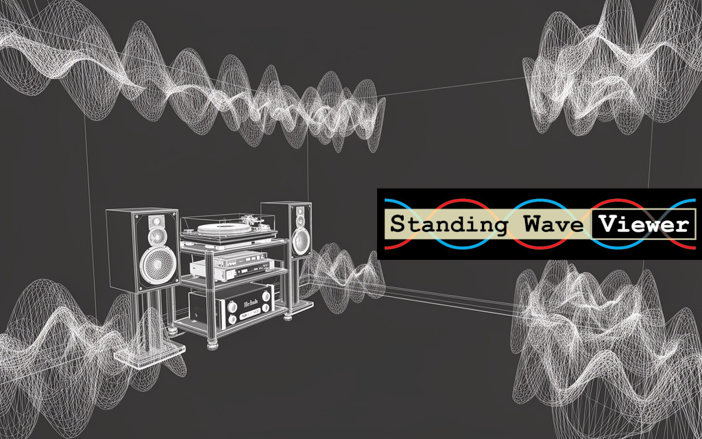

<span style="font-family: 'Hiragino Kaku Gothic ProN', 'Meiryo', sans-serif;">


Standing Wave Viewer は、部屋の定在波（ルームモード）と低周波の干渉パターンを計算・可視化するための3D音響シミュレーションツールです。サブウーファーやスピーカーの最適な配置、およびリスニングポジションの決定に役立つでしょう。技術的な詳細については、/documents/Q_A_J.mdを参照してください。

このプロジェクトは、個人的な欲求から始まったアマチュアの試みであり、プロの現場で使われるような、厳密な検証ツールを目指したものではありません。
部屋のクセをできるだけ直感的に把握できるよう、自分用に作ったものです。
しかし、出来上がってみると、世の中にあまり類のないツールになったように感じたので、公開することにしました。
もしどこかの誰かの役に立てば、これ以上の喜びはありません。

## ✨ 主な機能

- **インタラクティブな3Dレイアウト**: サイドバーのUIを使って、部屋の寸法、スピーカー座標、マイク座標を直感的に調整。リアルタイムで3Dワイヤーフレームに反映されます。
- **正確な周波数特性のシミュレーション**: 部屋の寸法と各壁の反射率を考慮し、指定したマイク位置における周波数特性（20Hz〜200Hz）を計算します。
- **3Dボリュームレンダリング可視化**: 空間全体の音圧分布（波の「腹」と「節」）を3Dのボリュームデータとして描画し、周波数を変化させながらアニメーション再生が可能です。
- **高度なステレオ干渉モデル**:
  モノラル設定に加え、ステレオ（2音源）設定時には以下の3つの計算モデルを選択可能です：
  - **Uncorrelated (Independent Power Sum)**: 干渉（打ち消し合い）を起こさず、単純なパワー加算を行います。
  - **In-Phase (Global Cancel - Fast)**: 高速に干渉を計算する近似モデルです。
  - **In-Phase (True Complex Field - Experimental)**: 空間の全座標で波を「複素数（実部＋虚部）」として合成し、非対称配置時に生じる「節の斜めの歪み」など、現実世界の生々しい干渉を再現しようとする試みです。ただし、実験段階なので現実を再現できていることを保証はできません。
- **カスタマイズ可能な壁面反射率**: 6つの面（前後左右の壁、床、天井）すべての反射係数（0.0〜1.0）を個別に設定可能です。
- **Spatial Smoothing機能**: マイクの座標の周り3x3x3の範囲で平準化を行い、実際の聞こえ方に寄せる機能です。In-Phaseのモデルにおける強烈なディップを均します。
- **ノートPCでの動作に最適化**: デフォルトでは非力なマシンでも快適に動作します。リッチなデスクトップ環境用にHigh resolution mode, Large 3D view modeをトグルで選択可能。

## 🚀 オペレーションモード

1. **🎛️ Layout Placement (Ultra-fast)**: スピーカーとマイクの配置を素早く検討するモードです。瞬時に1Dの周波数特性グラフを出力します。
2. **🌊 Standing Wave Viz (Current Setup)**: 現在のレイアウトに基づき、空間全体の3D音圧テンソルを計算・描画します。周波数スライダーや再生ボタンで空間の響きを視覚的に確認できます。
3. **📐 Room Bare Specs (Rigid/Corner)**: 部屋の「素の特性」を確認するためのベースラインモードです。反射率1.0（完全剛体）、音源をコーナーに配置した状態をシミュレートし、部屋固有の定在波の形を可視化します。

## 🛠️ インストールと実行方法

### 必須環境
- Python 3.7以降
- `streamlit`
- `numpy`
- `plotly`

### 起動方法 (ローカルホスト)
1. リポジトリをクローンします。
2. 必要なライブラリをインストールします：
   ```bash
   pip install streamlit numpy plotly
   ```
3. Streamlitアプリを起動します：
   ```bash
   streamlit run Standing_Wave_Viewer.py
   ```
その後、ブラウザでローカルホストを呼び出してください（通常は `http://localhost:8501`）。

### Streamlit cloudにもデプロイされています
https://standing-wave-viewer.streamlit.app/
休止中の場合は、リベイクしてください。

免責事項

本ソフトウェアは現状のまま（"AS IS"）提供されるものであり、明示・黙示を問わず、いかなる保証も行いません。
作者は、本ソフトウェアの利用または利用不能により生じたいかなる損害についても、一切の責任を負いません。
本ソフトウェアは、個人利用および学習・検討のための参考ツールとして提供されるものであり、プロフェッショナルな用途における厳密な検証結果や設計判断の唯一の根拠として用いることは想定していません。
また、本リポジトリは、本ソフトウェア自体の動作や使い勝手、品質の向上と直接関係しない一般的な議論や主張を行う場所ではありません。
そのようなトピックに関する議論やコメントについては、本プロジェクトの範囲外とみなし、対応・返信できない場合があります。